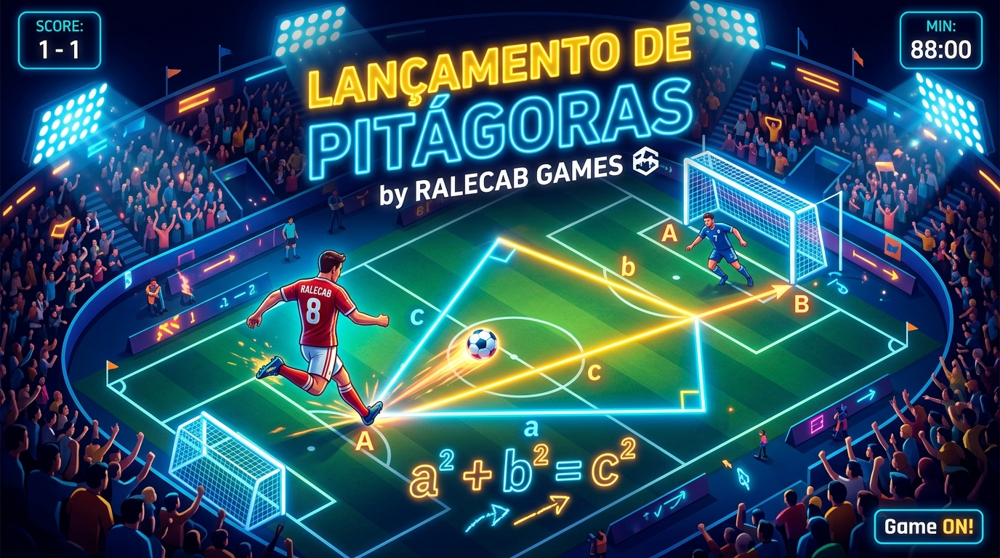

# Lançamento de Pitágoras

<div align="center">



**Jogo Educativo de Futebol & Geometria Interativa**  
Criado com paixão por **RALECAB GAMES**

[](https://github.com/ralecab/lancamento-pitagoras/actions/workflows/verify.yml)
[](https://developer.mozilla.org/en-US/docs/Web/Progressive_web_apps)
[](https://www.typescriptlang.org/)
[](https://react.dev/)
[](LICENSE)

</div>

---

## ⚽ Sobre o Jogo

**Lançamento de Pitágoras** é uma experiência lúdica e pedagógica que transforma o aprendizado do **Teorema de Pitágoras** em uma jogada decisiva de futebol. O jogador assume o papel do meio-campista clássico (camisa 10), responsável por calcular a trajetória exata da hipotenusa para conectar um passe milimétrico ao atacante dentro da grande área.

$$C = \sqrt{A^2 + B^2}$$

- **Cateto A (Horizontal)**: Deslocamento horizontal do passe em metros.
- **Cateto B (Vertical)**: Deslocamento vertical do passe em metros.
- **Hipotenusa C (Distância Real)**: Distância exata da trajetória da bola calculada pelo jogador.

---

## 🎮 Mecânicas e Funcionalidades

### 1. Física de Passe & Cálculo Real
- **Cálculo pelo Jogador**: A hipotenusa $C$ começa vazia. O jogador calcula e digita o valor com duas casas decimais (aceita vírgula ou ponto).
- **Controles de Ajuste Fino**: Botões táteis de $\pm 0.01$ e $\pm 0.10$ para calibrar a medida com precisão.
- **Validação Milimétrica**:
  - **Passe Perfeito**: A bola chega com perfeição ao atacante, que finaliza para o gol!
  - **Passe Curto**: A bola para antes da marcação e o ataque é neutralizado.
  - **Passe Longo**: A bola ultrapassa o atacante e sai pela linha de fundo.

### 2. Estádios & Atmosferas Dinâmicas
Três fases sequenciais com identidades visuais e sonoras temáticas:
1. **Bahia (Arena Fonte Nova - Tarde Ensolarada)**: Céu límpido, gramado vibrante e clima de estreia.
2. **Flamengo (Maracanã - Entardecer Dourado)**: Pôr do sol clássico, alta intensidade e maior exigência nos cálculos.
3. **Cruzeiro (Mineirão - Noite de Decisão)**: Refletores acesos, atmosfera elétrica de final e consagração do título.

### 3. Apoio Pedagógico & Inclusão
- **Fórmula Passo a Passo**: Painel retrátil de apoio didático demonstrando a resolução da equação e notas sobre raízes irracionais.
- **Internacionalização (i18n)**: Suporte completo e instantâneo a **Português (Brasil)**, **Inglês** e **Espanhol**.
- **Acessibilidade Universal**: Compatibilidade WCAG 2.1 AA, regiões ARIA live com narração de jogadas para leitores de tela e contrastes validados.

### 4. Experiência Universal (Mobile & Desktop)
- **Design Mobile-First Nativo**: Otimizado para telas touch com alvos de interação $\ge 44\text{px}$, suporte a `100dvh` e respeito aos insets de safe-area (iOS e Android).
- **Palco Centralizado no Desktop**: Em telas maiores, a aplicação adota uma cabine de smartphone estilizada, garantindo que o gramado e os atletas **nunca sejam encobertos** por menus ou teclados virtuais.
- **PWA (Progressive Web App)**: Jogue offline em qualquer lugar! Instalável nativamente na tela inicial, com Service Worker precacheando todos os ativos essenciais.

---

## 🛠️ Tecnologias Utilizadas

- **Core**: React 19, TypeScript, Vite
- **Estilização**: Tailwind CSS v4, Lucide React Icons
- **Gráficos**: Canvas 2D nativo com projeção de escala uniforme (sem distorções anamórficas)
- **Testes & Qualidade**: Vitest, TypeScript Typecheck (`tsc --noEmit`)
- **PWA**: `vite-plugin-pwa`, Workbox, Web App Manifest W3C
- **CI/CD**: GitHub Actions (Workflows de Verificação Contínua e Deploy automático no GitHub Pages)

---

## 🚀 Instalação e Execução

### Pré-requisitos
- Node.js 20+ ou 22+
- npm ou compatível

### Passo a Passo

```bash
# 1. Clonar o repositório
git clone https://github.com/ralecab/lancamento-pitagoras.git
cd lancamento-pitagoras

# 2. Instalar as dependências
npm install

# 3. Iniciar o servidor de desenvolvimento
npm run dev
```

Acesse `http://localhost:3000` em seu navegador.

---

## 🧪 Suíte de Testes & Verificação

O projeto segue a metodologia **Spec-Driven Development (SDD)** e testes rigorosos:

```bash
# Executar suíte completa de testes (matemática, geometria, layout, pwa, acessibilidade)
npm test

# Verificação estática de tipos
npm run lint

# Build de produção e geração do PWA
npm run build

# Validador automatizado (Ralph Loop)
npm run ralph:fast   # Modo rápido
npm run ralph        # Modo completo com build
```

---

## 📦 Pipeline GitHub Actions

O repositório está configurado com dois workflows automáticos:
1. **`.github/workflows/verify.yml`**: Executado em todo push ou pull request para `main`. Valida compilação, testes Vitest e build de produção.
2. **`.github/workflows/deploy.yml`**: Executado ao fazer push na branch `main`. Constrói o artefato estático e publica automaticamente no **GitHub Pages**.

---

## 📄 Licença

Distribuído sob a licença [MIT](LICENSE).  
Copyright &copy; 2026 **RALECAB GAMES**. Todos os direitos reservados.
